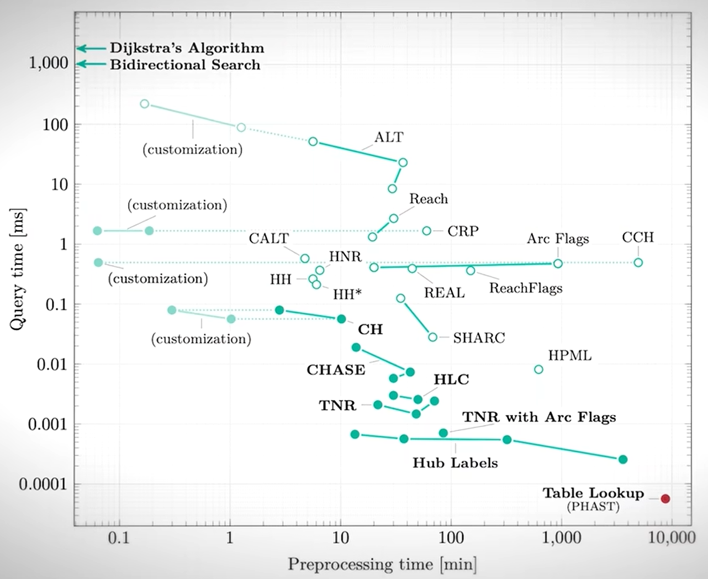

# HERMES: Hierarchical Efficient Routing and Modular Evolution System

HERMES is a system for computing shortest paths and processing real-time updates on large, dynamic road networks. It combines hierarchical graph partitioning, a shortcut network overlay, and a concurrency control scheme so that routing queries and network updates can run at the same time without blocking each other or producing inconsistent results.

This repository contains multiple implementations of the core algorithms (Go, Java, C++), a vendored Rust baseline used for comparison, datasets used for testing, and the analysis scripts used to produce the performance results described in the accompanying report.

## Table of contents

- [Background](#background)
- [How HERMES works](#how-hermes-works)
  - [1. Partitioning: Natural Cuts Based Connectivity Clustering (NCCC)](#1-partitioning-natural-cuts-based-connectivity-clustering-nccc)
  - [2. Multi-Level Partitioning (MLP) and the shortcut network](#2-multi-level-partitioning-mlp-and-the-shortcut-network)
  - [3. Routing queries: Hierarchical Bidirectional Dijkstra](#3-routing-queries-hierarchical-bidirectional-dijkstra)
  - [4. Update processing](#4-update-processing)
  - [5. Concurrency control](#5-concurrency-control)
- [Repository structure](#repository-structure)
- [Getting started](#getting-started)
- [Performance summary](#performance-summary)
- [Third party components](#third-party-components)
- [References](#references)

## Background

Classic shortest path computation on road networks relies on Dijkstra's algorithm or its bidirectional variant. These are correct but slow on continental-scale graphs, which is why most practical routing systems preprocess the graph to add shortcuts that let queries skip over large sections of the network. Well known approaches in this space include ALT, Contraction Hierarchies, and Arc Flags.

Static preprocessing does not handle networks that change over time, for example, due to live traffic conditions or temporary closures. HERMES is built around the idea that a routing system needs to support both fast queries and frequent updates at the same time, which means the query and update paths need explicit concurrency control rather than assuming the graph is fixed.

Road networks are modeled as directed, weighted graphs: intersections and geographic points are vertices, road segments are edges, and each edge is weighted by a cost metric such as distance or travel time.

<p align="center">
  
</p>

## How HERMES works

HERMES is structured around five stages: an offline partitioning phase, a hierarchy and shortcut-network construction phase, an online routing phase, an online update phase, and a concurrency control layer that lets the last two run safely at the same time.

### 1. Partitioning: Natural Cuts Based Connectivity Clustering (NCCC)

The graph is broken into partitions in three phases, inspired by multilevel graph partitioning:

- **Phase I : Coarsening.** Nodes are inserted incrementally rather than partitioning the whole graph at once (which wouldn't fit in memory for continental-scale networks). As each node is added, its neighboring disk pages are located, updated, and split once they exceed a size threshold, so that partitions stay small enough to fit on a single disk page. This is guided by the Weighted Cut-Reduction Ratio (WCRR), the fraction of total edge weight contained within pages rather than crossing between them. HERMES maximizes this to minimize I/O cost at query time.
- **Phase II.1 : Tiny Cuts.** k-connected components are found via DFS, then recursively contracted top-down. **One-Cut** collapses a small component that is isolated from the rest of the graph by a single edge. **Two-Cut** identifies equivalence classes of edges via the Pritchard–Thirumalla algorithm and compresses components whose combined size is below the threshold `U`.
- **Phase II.2 : Natural Cuts.** A BFS tree is grown from a randomly chosen vertex to define a *core* (the tree up to size `aU/f`) and a *ring* (its neighboring boundary). The core and ring are each merged into a single vertex, and a minimum s–t cut is computed between them using edge weights as capacities. The complement graph of the cut edges is then contracted into *fragments*.
- **Phase III : Integration.** The refined partitions are assembled using one of three techniques: a randomized **Greedy Algorithm** that iteratively merges high-connectivity, low-size vertex pairs; a **Local Search** procedure that refines a contracted auxiliary representation of the current partition; and a **Multistart and Combination** heuristic that runs the greedy algorithm multiple times with different randomization seeds and combines the results.

### 2. Multi-Level Partitioning (MLP) and the shortcut network

The base-level partitions produced by NCCC are organized into a hierarchy. Within each partition, nodes are classified as:

- **Internal nodes** : both endpoints of their edges lie inside the partition.
- **Border nodes** : one endpoint lies outside the partition.
- **Upper-level partition border nodes** : nodes with edges leaving the parent partition at the next level up.

An all-pairs shortest path computation is then run *within* each partition (ignoring edges that leave it) to connect its border nodes. The resulting edge weights are used to build a **shortcut network**, which is passed up and overlaid onto the partition at the next level of the hierarchy. This means each higher level only has to reason about a much smaller graph of shortcuts between border nodes, rather than the full underlying road network.

### 3. Routing queries: Hierarchical Bidirectional Dijkstra

Given a query from source `S` to target `T`:

1. **Initialization.** `S` and `T` share their first common partition at some level `i` in an `n`-level hierarchy.
2. **Forward and backward search.** A forward search grows from `S` and a backward search grows from `T` simultaneously, each moving toward the border node of its own partition.
3. **Border node transition.** Once a search reaches its partition's border node, it jumps up to the next level of the hierarchy and continues from there, using the shortcut network instead of the raw graph.
4. **Convergence.** The two searches repeat this climb-and-search process until they meet at a common partition level, at which point the shortest path cost is known.

The path itself is then recovered with the **Path Unpacker**, which recursively expands the shortcut edges used by the query, first extracting the initial coarse path from the top-level border network, then unpacking it one level at a time until it is fully expressed in terms of the original road segments.

### 4. Update processing

Live changes to the network (new edges, changed weights, closures) are not applied one at a time. Instead:

1. Updates are delayed and collected until a fixed interval elapses, then applied together in a **batch**.
2. For each level of the hierarchy, HERMES identifies the cells affected by the batch of edge-weight changes.
3. Each affected cell has its shortest paths recomputed via an all-pairs shortest path algorithm.
4. If the recomputed shortcut network is unchanged from the previous configuration, the parent partition at the level above is left untouched, avoiding unnecessary propagation up the hierarchy.
5. This process repeats level by level until every affected partition has been recomputed.

Batching keeps update cost proportional to the size of the affected region rather than the whole graph, and avoids re-triggering a full re-partitioning pass on every single edge change.

### 5. Concurrency control

Concurrent execution of routing (read) queries and update (write) transactions can produce inconsistent results if left unmanaged. HERMES addresses this with two mechanisms working together:

- **The Delta Phase.** While a batch of updates is being applied to a region of the graph, that period is marked as the delta phase for the affected cells. A read query traces its route from `S` to `T`, checking each cell along the path for whether it falls inside an active delta phase. If none of the cells it touches are affected, the query proceeds immediately against the latest committed graph version (`v0`, `v1`, `v2`, ...). If some are, the read query waits for the delta phase to resolve before resuming, rather than reading a partially-updated (inconsistent) partition.
- **Two-Phase Locking (2PL).** Update transactions acquire and release locks according to the two-phase discipline. All lock acquisitions precede any lock release within a transaction. This guarantees conflict serializability: every concurrent schedule of routing and update queries is guaranteed to have the same effect as some serial execution of them, which is the standard correctness condition used by commercial database schedulers.

Together, these let HERMES support update-heavy workloads (frequent batched updates with brief read stalls limited to affected regions) and routing-heavy workloads (continuous query throughput with updates applied transparently in the background) without sacrificing correctness.

## Repository structure

```
HERMES/
├── go-spcs/                         Main Go implementation of HERMES
│   ├── spcs/                        Entry point and example programs
│   ├── dch/                         Core graph processing and routing engine
│   │   ├── utils/                   Graph structures, Dijkstra, contraction, import/export utilities, heaps, etc.
│   │   └── tests/                   Unit tests for core algorithms
│   └── demo/                        Experimental framework and evaluation suite
│       ├── src/                     Partitioning, MLP, routing, update processing, and concurrency control
│       ├── simulator/               Workload and concurrency simulators
│       ├── runnable/                Executable entry points and benchmark configurations
│       ├── analyzers/               Python scripts for log analysis and visualization
│       └── tests/                   End-to-end integration tests
│
├── java-spcs/                       Java implementation (Gradle project)
│   └── app/src/main/java/csps/      Graph data structures and algorithm implementations
│
├── cpp-spcs/                        Early C++ prototype and experimental implementation
│   ├── src/                         Source code and headers
│   ├── test/                        Sample graph datasets
│   └── plot/                        Gnuplot scripts and benchmark visualizations
│
├── rust-spcs/                       Vendored implementation of the "fast_paths" library
│                                    (MIT/Apache-2.0) used as the Contraction
│                                    Hierarchies baseline for benchmarking
│
├── datasets/                        Road network datasets and preprocessing utilities
│
└── go.work                          Go workspace configuration for the Go modules
```


## Getting started

### Go implementation (primary)

Requires Go 1.21.6 or later.

```bash
cd HERMES
go work sync
cd go-spcs/demo/runnable
go run main.go
```

Run configuration, including which graph file to load, the number of hierarchy levels, and which test suite to run (routing only, or routing plus concurrent updates) is set in `go-spcs/demo/config/config.yaml`.

To run the Go unit and integration tests:

```bash
cd go-spcs/dch/tests
go test ./...

cd ../../demo/tests
go test ./...
```

### Java implementation

Requires a JDK compatible with the Gradle wrapper included in the repository.

```bash
cd java-spcs
./gradlew build
./gradlew test
```

### C++ implementation

```bash
cd cpp-spcs/src
make
./edp_main
```

### Rust baseline (Contraction Hierarchies comparison)

```bash
cd rust-spcs
cargo build --release
```

### Datasets

`datasets/dataset_converter.py` converts raw graph data into the CSV/edge list format expected by the Go, Java, and C++ implementations. Sample datasets are provided under `datasets/misc/`.

### Analysis scripts

`go-spcs/demo/analyzers/routing_analysis/` contains the Python scripts (`routing_analysis.py`, `routing_viz.py`) used to turn raw query logs into the percentile tables, confusion matrices, and timing plots referenced below. They read from `go-spcs/demo/runnable/results/` and expect `pandas`, `matplotlib`, and `scikit-learn`.

```bash
cd go-spcs/demo/analyzers/routing_analysis
python routing_analysis.py
python routing_viz.py
```

## Performance summary

HERMES was evaluated against Contraction Hierarchies (CH) as a baseline on a real-world US road network dataset (~23 million nodes, ~58 million edges), using a purpose-built simulator capable of running both systems under identical routing and update workloads.

**Correctness:** verified with a confusion matrix comparing expected versus computed query costs across a large batch of routing queries. Both CH and HERMES produced a clean diagonal, confirming computed shortest-path costs matched expected values exactly.

**Routing query latency (microseconds), by percentile**

| Percentile | CH       | HERMES   |
| ---------- | -------- | -------- |
| 50th       | 0.0000   | 0.0000   |
| 75th       | 0.5204   | 0.0000   |
| 90th       | 1.0013   | 0.3768   |
| 95th       | 1.0292   | 0.5228   |
| 99th       | 6.9991   | 1.1522   |

**Update query latency (milliseconds), by percentile**

| Percentile | HERMES  |
| ---------- | ------- |
| 50th       | 38.449  |
| 75th       | 45.032  |
| 90th       | 61.842  |
| 95th       | 66.780  |
| 99th       | 67.501  |

HERMES showed consistently lower and less variable routing query latency than the CH baseline, with a notably smaller tail (99th percentile). CH exhibited larger, more irregular spikes in per-query execution time, while HERMES stayed comparatively stable across the full query stream. Update latency stayed stable even under concurrent routing load, since updates are batched and query execution is not blocked while a batch is applied, except for the read queries that touch cells actively being updated.

In concurrency stress tests, HERMES sustained both an update-heavy workload (batched updates with brief per-cell read delays during the delta phase) and a routing-heavy workload (continuous routing throughput with updates applied transparently at fixed 10-second intervals) without correctness violations.

## Third party components

`rust-spcs` bundles the `fast_paths` crate by easbar (<https://github.com/easbar/fast_paths>), licensed under MIT/Apache-2.0, and is used only as the Contraction Hierarchies baseline for benchmarking. It is not part of the HERMES implementation itself; see `rust-spcs/LICENSE-MIT` and `rust-spcs/LICENSE-APACHE` for its license terms.

## References

- E. W. Dijkstra. *A note on two problems in connexion with graphs.* Numerische Mathematik, 1:269–271, 1959.
- A. V. Goldberg and C. Harrelson. *Computing the shortest path: A\* search meets graph theory.* SODA '05.
- R. Geisberger, P. Sanders, D. Schultes, and C. Vetter. *Exact routing in large road networks using contraction hierarchies.* Transportation Science, 46:388–404, 2012.
- M. Hilger, E. Köhler, R. H. Möhring, and H. Schilling. *Fast point-to-point shortest path computations with arc-flags.* 2005.
- D. Delling, P. Sanders, D. Schultes, and D. Wagner. *Engineering route planning algorithms.* In Algorithmics of Large and Complex Networks, LNCS 5515, pages 117–139. Springer, 2009.
- Hector Garcia-Molina, Jeffrey D. Ullman, Jennifer Widom. *Database Systems: The Complete Book.* Pearson, 2001 (§18.3.4, two-phase locking correctness proof).
